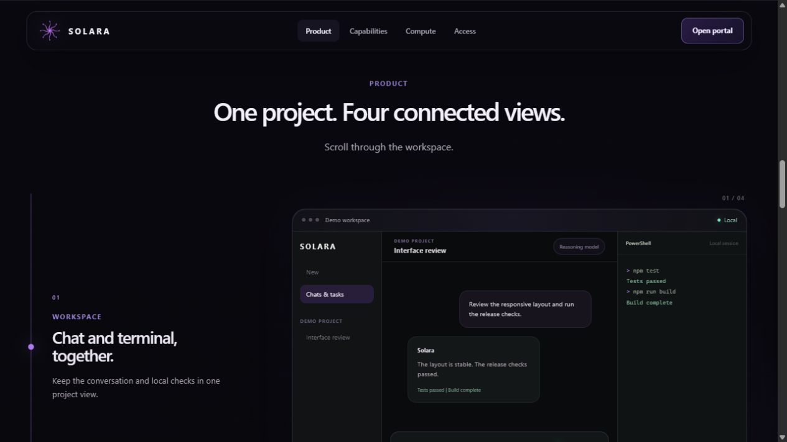

# Solara

A Windows workspace for AI-assisted software development, by Solarna Systems.
Projects, conversations, models, and tools share one place to work.

[Product website](https://usesolara.pages.dev/) ·
[Explore the product tour](https://usesolara.pages.dev/#product) ·
[Alpha access portal](https://alpha-solara.pages.dev/)

*Public product-tour capture, 24 September 2026. The illustrated workspace uses
demo content; it is not a record of a customer project or a benchmark run.*

## A project workflow

1. Open a project and keep its files, conversations, and decisions together.
2. Choose the model/provider route for the task.
3. Review proposed changes and tool actions, then inspect local checks in the terminal.
4. Use activity and task history to follow work and return to it later.

The public tour shows the workspace, model selection, calendar, and agent graph.
Features and access continue to change during development.

## Current availability

**Windows early alpha.** Access and any published Windows build are managed
through the authenticated portal. This is not a general-availability release.
See the product website for the current build and access information.

Solara is local-first, with configurable model providers. Requests to external
providers may send selected project context off the device.

## About this repository

This is a public product overview. Solara is proprietary; implementation and
operational infrastructure remain private.

[Developer and project background](https://majdbenchobba.github.io/solara.html) ·
[Solarna Systems](https://solarnasystems.com/)
